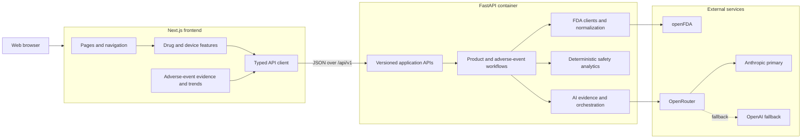

# Application Design

## Overview

The Product Intelligence Platform uses an independent Next.js frontend and FastAPI backend. The Next.js drug and device experiences have feature parity with the original interface and provide tabbed FDA results with deterministic adverse-event analytics: FAERS for drugs and MAUDE for devices. The FastAPI-rendered pages remain temporarily available as a fallback. Business logic, FDA access, safety analytics, and AI orchestration stay in the backend.

## Major Components

No hosting provider is integrated at this stage. Provider-neutral deployment procedures are documented separately in `docs/DEPLOYMENT_VERCEL.md` and `docs/DEPLOYMENT_AWS.md`.
- Only FastAPI receives FDA and OpenRouter credentials.
- The adverse-event APIs return application-domain analytics and explicit matching metadata rather than raw FAERS or MAUDE payloads.
- Device-event matching tries exact Device Identifier, model number, catalog number, and brand name in order, without combining identities.
- AI does not participate in adverse-event calculations; evidence-grounded AI safety interpretation belongs to Phase 4.
