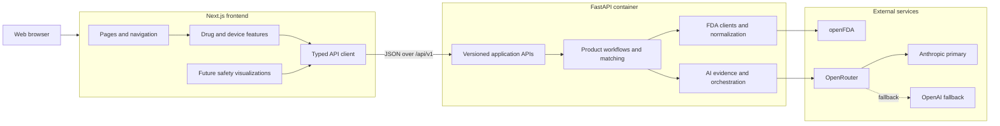

# Application Design

## Overview

The Product Intelligence Platform uses an independent Next.js frontend and FastAPI backend. The Next.js drug and device experiences have feature parity with the original interface; the FastAPI-rendered pages remain temporarily available as a fallback. Business logic, FDA access, and AI orchestration stay in the backend.

## Major Components

No hosting provider is integrated at this stage. Provider-neutral deployment procedures are documented separately in `docs/DEPLOYMENT_VERCEL.md` and `docs/DEPLOYMENT_AWS.md`.
- Only FastAPI receives FDA and OpenRouter credentials.
